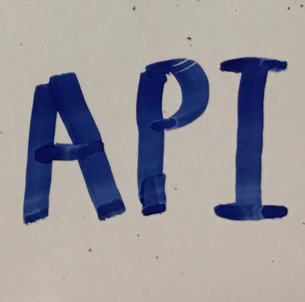
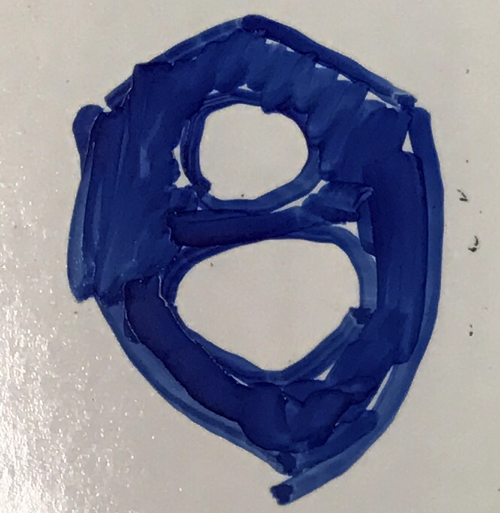
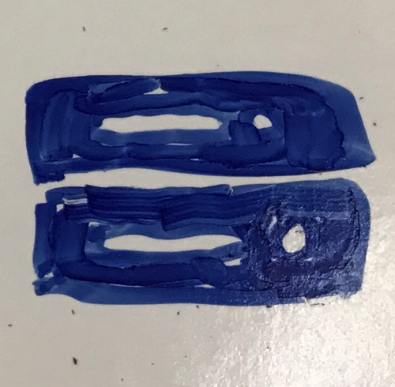
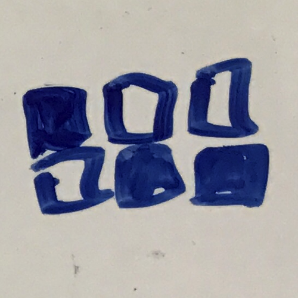
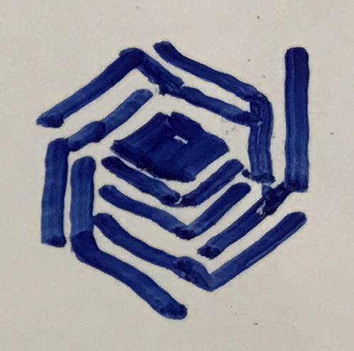
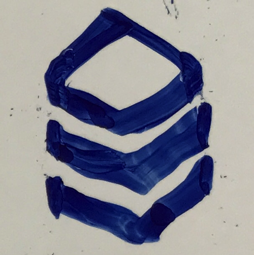
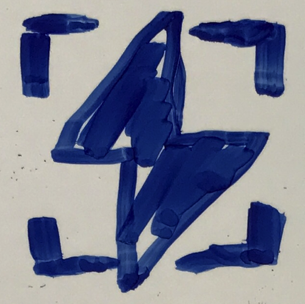

# GCP手書きアイコンセット

Google Cloud Platformの手書きで書いたアイコンセットです。

**サイズは500pxで統一しています**

## Home

### API Manager

### IAM

## Computing

### App Engine

### Compute Engine

### Network

### Cloud Functions

## Storage

### Cloud Storage

### Datastore

### Bigtable

### SQL

## Stackdriver

### Monitoring

### Debug

